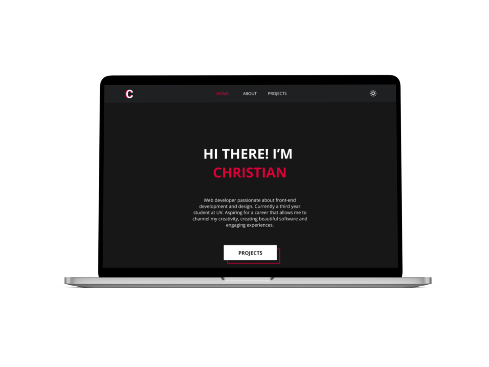

# [PERSONAL PORTFOLIO]() 👨‍💻

Learn about my web development expertise. Explore a collection of interactive and responsive websites built using the latest technologies such as ReactJS, Vanilla JavaScript, CSS, SCSS, Tailwind and HTML. Demonstrate your skills and experience in designing and developing modern networking solutions.

## Built With

## Dependencies

Some dependencies I used were the following:

- **React Icons**
- **HTML**
- **SASS**
- **Framer Motion**
- **Atropos**
- **Hamburger React**

And the following development dependencies:

- **ESLint**
- **Standard**

## Author

Some of my platforms

- [Frontend Mentor | Christian's profile](https://www.frontendmentor.io/profile/FLCHRIS)
- [GitHub](https://github.com/FLCHRIS)